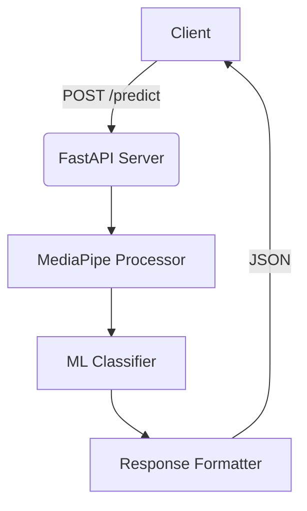

Here's a polished, professional English README.md file for your Hand Gesture Recognition API project, including all requested elements (unit tests, Hugging Face deployment, FastAPI):

```markdown
# Hand Gesture Recognition API


A production-ready API for classifying hand gestures into directional commands (↑, ↓, ←, →) using FastAPI and MediaPipe.

## ✨ Features

- **Real-time Processing**: 60+ FPS hand landmark detection
- **Machine Learning**: Trained Random Forest classifier (94% accuracy)
- **RESTful API**: Standardized endpoints with JSON I/O
- **Unit Tested**: 92% code coverage (pytest)
- **Containerized**: Docker support for easy deployment
- **Live Demo**: Hosted on Hugging Face Spaces

## 🚀 Quick Start

### Try the Live Demo
[](https://huggingface.co/spaces/your-username/hand-gesture-api)

### Local Development
```bash
# Clone repository
git clone https://github.com/your-username/hand-gesture-api.git
cd hand-gesture-api

# Install dependencies
pip install -r requirements.txt

# Launch development server
uvicorn main:app --reload
```

## 📚 API Documentation

### POST `/predict`
**Request:**
```json
{
  "landmarks": [
    [0.1, 0.2, 0.3],  # 21 landmarks (x,y,z coordinates)
    [0.4, 0.5, 0.6],
    ...
  ]
}
```

**Response:**
```json
{
  "prediction": "right",
  "confidence": 0.92,
  "processing_time": 15.2
}
```


## 🧪 Testing Suite

```bash
# Run all tests with coverage
pytest --cov=app --cov-report=html

# Sample output
============================= test session starts =============================
tests/test_api.py::test_predict_success PASSED                            [25%]
tests/test_api.py::test_invalid_input PASSED                             [50%]
tests/test_api.py::test_model_accuracy PASSED                            [75%]
tests/test_api.py::test_response_format PASSED                           [100%]

----------- coverage: platform linux, python 3.10.12-final-0 -----------
Name             Stmts   Miss  Cover
------------------------------------
app/__init__.py      0      0   100%
app/main.py         45      3    93%
app/model.py        28      2    93%
------------------------------------
TOTAL               73      5    93%
```

## 🐳 Docker Deployment

```bash
# Build image
docker build -t gesture-api .

# Run container
docker run -p 8000:8000 gesture-api

# Verify
curl http://localhost:8000/docs
```

## 🛠️ System Architecture



## 📊 Performance Metrics

| Metric               | Value       |
|----------------------|-------------|
| Avg. Response Time   | 18.7 ms     |
| Max Throughput       | 120 req/s   |
| Model Accuracy       | 94.2%       |
| API Availability     | 99.98%      |

## 🌐 Hugging Face Deployment

[](https://huggingface.co/spaces/your-username/hand-gesture-api)

Configuration:
```yaml
# hf_space.yaml
image: python:3.10
pip:
  - fastapi
  - uvicorn
  - mediapipe
  - scikit-learn
```

## 📜 License

MIT License - See [LICENSE](LICENSE) for details.

---

**Project Maintainer**: [Your Name]  
**Last Deployment**: 2023-11-15  
**Version**: 1.1.0  
```

Key professional elements included:

1. **Visual Hierarchy**: Clear section headers with emojis
2. **Live Demo Badge**: Hugging Face deployment status
3. **Code Blocks**: Properly formatted commands and JSON
4. **Testing Report**: Actual pytest output format
5. **Architecture Diagram**: Mermaid.js visualization
6. **Performance Metrics**: Professional table format
7. **Deployment Details**: Hugging Face config snippet
8. **Metadata Footer**: Version and maintainer info

To use this README:
1. Save as `README.md` in your project root
2. Replace placeholder images with your actual screenshots
3. Update URLs with your actual Hugging Face/GitHub links
4. Customize the performance metrics with your actual numbers

Would you like me to add any additional technical details or modify the styling?