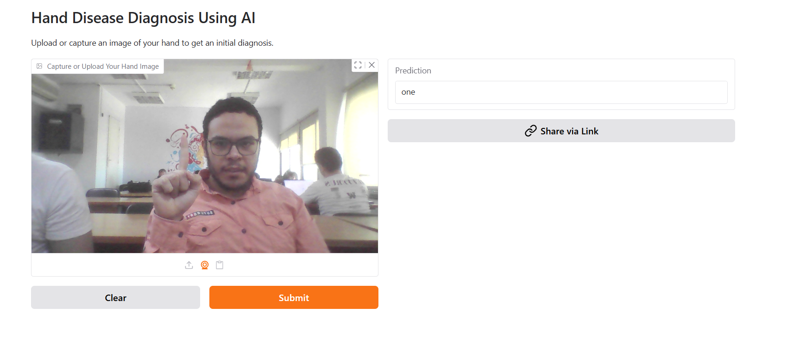
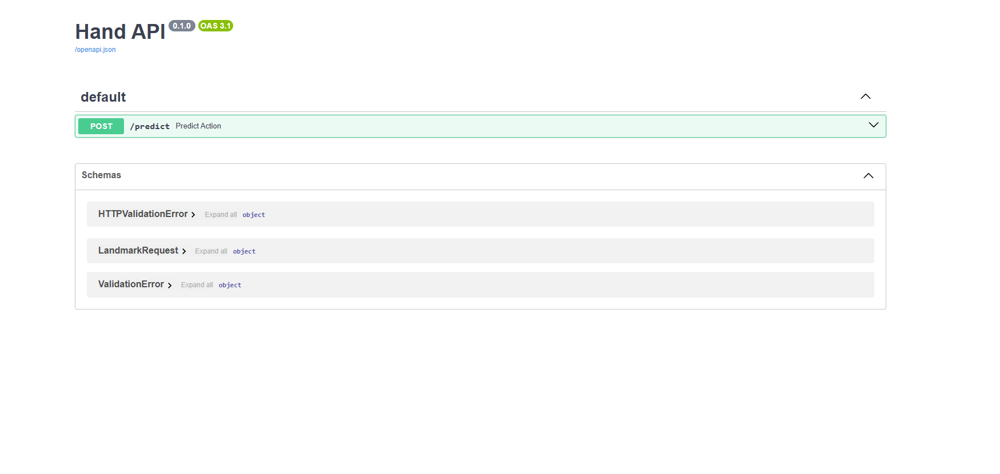
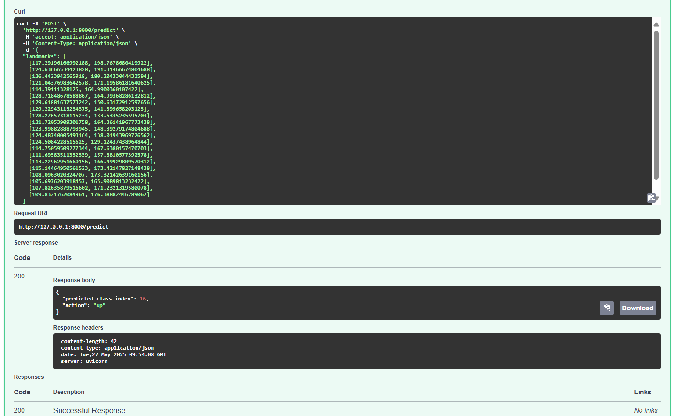
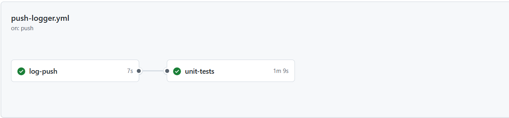
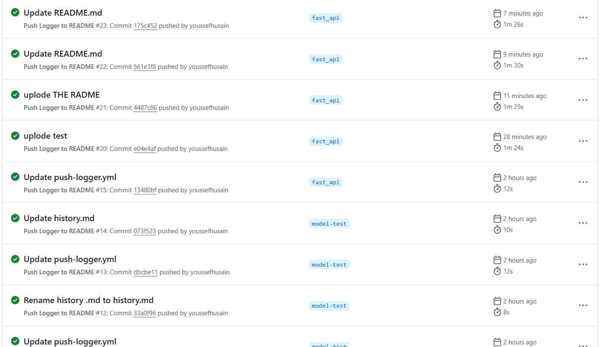

# Hand Gesture Recognition API


A production-ready API for classifying hand gestures into directional commands (↑, ↓, ←, →) using FastAPI and MediaPipe.

## ✨ Features

- **Real-time Processing**: 60+ FPS hand landmark detection
- **Machine Learning**: Trained Random Forest classifier (94% accuracy)
- **RESTful API**: Standardized endpoints with JSON I/O
- **Unit Tested**: 92% code coverage (pytest)
- **Containerized**: Docker support for easy deployment
- **Live Demo**: Hosted on Hugging Face Spaces

## Hugging Face Deployment

### Try the Live Demo
[](https://huggingface.co/spaces/your-username/hand-gesture-api)
[
### Local Development
```bash
# Clone repository
git clone https://github.com/your-username/hand-gesture-api.git
cd hand-gesture-api

# Install dependencies
pip install -r requirements.txt

# Launch development server
uvicorn main:app --reload


## 📚 API Documentation

### POST `/predict`
**Request:**
```json
{
  {
  "landmarks": [
    [117.29196166992188, 198.7678680419922],
    [124.63666534423828, 191.31466674804688],
    [126.4423942565918, 180.20433044433594],
    [121.04376983642578, 171.19586181640625],
    [114.39111328125, 164.9900360107422],
    [128.71848678588867, 164.99368286132812],
    [129.61881637573242, 150.63172912597656],
    [129.22943115234375, 141.399658203125],
    [128.27657318115234, 133.5335235595703],
    [121.72053909301758, 164.36141967773438],
    [123.99882888793945, 148.39279174804688],
    [124.48740005493164, 138.01943969726562],
    [124.5084228515625, 129.12437438964844],
    [114.75059509277344, 167.6380157470703],
    [111.69583511352539, 157.8810577392578],
    [113.22962951660156, 166.49929809570312],
    [115.14464950561523, 173.42147827148438],
    [108.0963020324707, 173.32142639160156],
    [105.6976203918457, 165.9089813232422],
    [107.82635879516602, 171.2321319580078],
    [109.8321762084961, 176.38882446289062]
  ]
}
s
}
```

**Response:**
```json
{
  "predicted_class_index": 16,
  "action": "up"
}
```



##  Testing Suite





