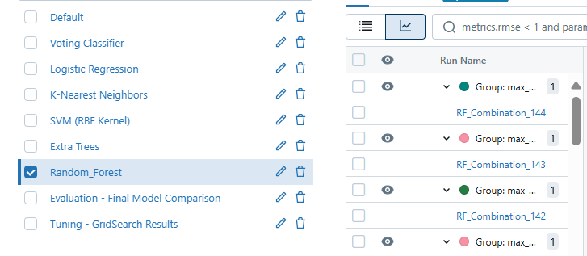
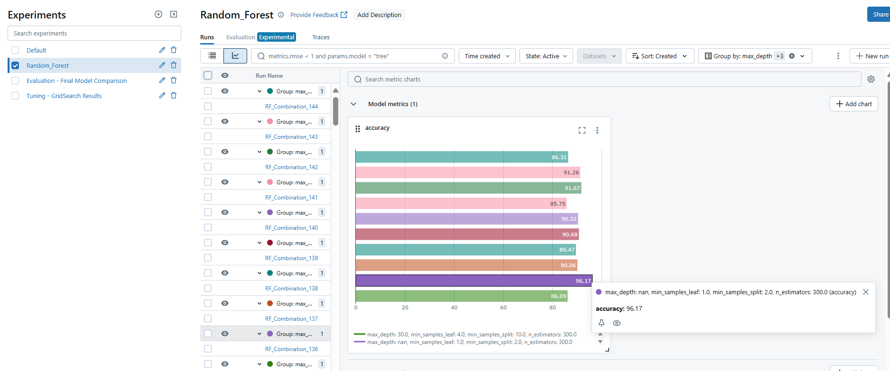
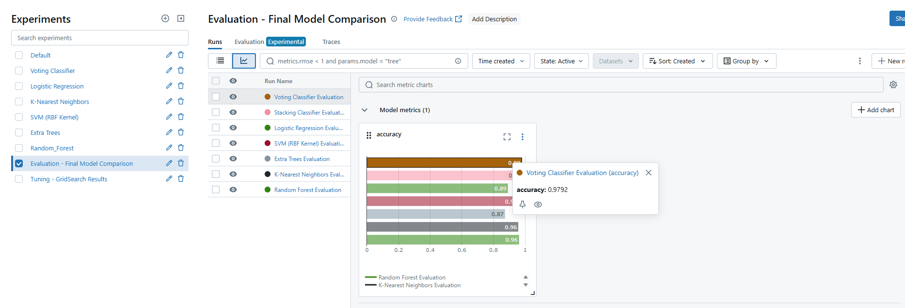

## model select 
In this Branche  , I test a classification system using powerful machine learning models such as:

- Random Forest
- Support Vector Machine (SVM)
- Extra Trees Classifier
- K-Nearest Neighbors (KNN)
- Logistic Regression

I also experimented with **Stacking** and **Voting Ensemble** methods to improve performance by combining the outputs of multiple models.

---

---

## ⚙️ Hyperparameter Tuning
Grid Search was used to explore multiple combinations of hyperparameters for each model to achieve the best performance.

### 🔹 Random Forest
```python
param_grid = {
    'n_estimators': [50, 100, 200, 300], 
    'max_depth': [10, 20, 30, None],  
    'min_samples_split': [2, 5, 10],   
    'min_samples_leaf': [1, 2, 4]      
}
```


- **Best Parameters**:  
  `{'n_estimators': 300, 'max_depth': None, 'min_samples_split': 2, 'min_samples_leaf': 1}`
- **Best Accuracy**: 0.9617

### 🔹 Support Vector Machine (SVM)
- **Best Parameters**:  
  `{'C': 100, 'gamma': 0.001, 'kernel': 'rbf'}`
- **Best Accuracy**: 0.9593

### 🔹 Extra Trees Classifier
- **Best Parameters**:  
  `{'n_estimators': 50, 'max_depth': 10, 'min_samples_split': 2, 'min_samples_leaf': 1}`
- **Best Accuracy**: 0.9593

### 🔹 K-Nearest Neighbors (KNN)
- **Best Parameters**:  
  `{'n_neighbors': 3, 'weights': 'uniform', 'metric': 'euclidean'}`
- **Best Accuracy**: 0.9593

---

## 🤖 Ensemble Learning

### 🔸 Stacking Classifier
Combined the output of the top-performing models (Random Forest, Extra Trees, KNN, SVM) using a Logistic Regression meta-learner.

- **Accuracy**: **0.9812**

### 🔸 Voting Classifier
Used soft voting ensemble with:

- Random Forest  
- Extra Trees  
- KNN  
- SVM  
- Logistic Regression

- **Accuracy**: **0.9792**

---

## 🏁 Final Model Comparison

| Model                  | Accuracy |
|------------------------|----------|
| Random Forest          | 0.9617   |
| SVM (RBF Kernel)       | 0.9593   |
| Extra Trees Classifier | 0.8730   |
| KNN                    | 0.9566   |
| Logistic Regression    | 0.8911   |
| Stacking Ensemble      | 0.9812   |
| Voting Ensemble        | 0.9792   |

---

##  Tools & Libraries Used

- `scikit-learn`
- `pandas`
- `numpy`
- `matplotlib`
- `seaborn`
- `mlflow` (for experiment tracking)

---

